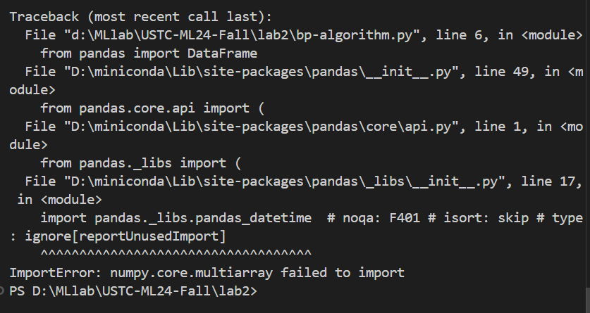

### 实验报告：神经网络分类算法实验

#### 一、实验目标
1. 理解神经网络分类算法的原理，掌握前向传播和反向传播的过程。
2. 使用 Python 实现神经网络分类算法，并通过鸢尾花（Iris）数据集进行实验。
3. 调用现有库与手动实现神经网络算法，比较模型性能，优化超参数。


#### 二、实验结果

##### 1. 调用库实现
- **库：** 
- 使用`MLPClassifier`（来自`scikit-learn`）。
- **结果：**
  
  
  
  
  
##### 2. 手动实现神经网络
- **结果：**
  
  
  
  
  
  

#### 三、实验的关键代码
第一部分中只需调用库即可实现，关键在于手动实现神经网络算法，其中的重要代码及注释如下
```python
def forward(self, X):
        self.hidden_layer_input = np.dot(X, self.weights_input_hidden) + self.bias_hidden  #隐藏层输入
        self.hidden_layer_output = self.sigmoid(self.hidden_layer_input)  # 隐藏层输出
        self.output_layer_input = np.dot(self.hidden_layer_output, self.weights_hidden_output) + self.bias_output  #输出层输入
        self.output = self.sigmoid(self.output_layer_input)  # 输出层输出
        return self.output
        
    def backward(self, X, y, output, learning_rate):
        # 反向传播更新权重和偏置
        output_error = y - output  # 输出层误差
        output_delta = output_error * self.sigmoid_derivative(output)  # 输出层梯度

        hidden_error = output_delta.dot(self.weights_hidden_output.T)  # 隐藏层误差
        hidden_delta = hidden_error * self.sigmoid_derivative(self.hidden_layer_output)  # 隐藏层梯度

        # 更新隐藏层到输出层的权重和偏置
        self.weights_hidden_output += self.hidden_layer_output.T.dot(output_delta) * learning_rate
        self.bias_output += np.sum(output_delta, axis=0, keepdims=True) * learning_rate

        # 更新输入层到隐藏层的权重和偏置
        self.weights_input_hidden += X.T.dot(hidden_delta) * learning_rate
        self.bias_hidden += np.sum(hidden_delta, axis=0, keepdims=True) * learning_rate
```

#### 四、对比与分析
- **调用库实现：** 
- 测试不同的隐藏层神经元数量（5个、10个），发现10个神经元时模型表现最佳。
- 下图为5个的情况，显然最大迭代次数过小导致还未达到最优化，准确率也有所下降
  

- **手动实现：**
- 测试测试不同的隐藏层神经元数量（5个、10个），发现10个神经元时模型表现最佳。
- 下图为5个的情况，其中lr=0.001，epochs=1000，显然准确率很差


#### 五、实验时间
实验总耗时：约8小时（包括代码调试、结果可视化和报告撰写）。

#### 七、总结与反馈
- 本次实验比起第一次来说简单了不少~~当然也是因为遭受了lab1的折磨已经变得更强~~，
- 当然不知道是什么原因，vscode突然无法运行文件输出，报错如下，但是用Prompt还是能运行下去
  
- 可视化文件在lab2的bp_visualize1和bp_visualize2文件中
